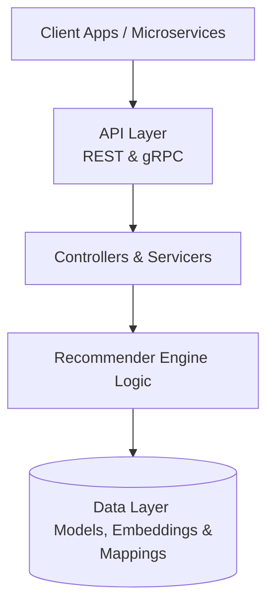

# Anime Recommender API

A hybrid recommendation service for Anime, combining Content-Based Filtering, Collaborative Filtering, and Natural Language Processing. This microservice provides both **REST (FastAPI)** and **gRPC** interfaces.

## Features

- **Hybrid Recommendation Engine**: Achieves recommendations by blending CF ratings, metadata features, and NLP embeddings.
- **Natural Language Search**: Supports dynamic semantic searches via HuggingFace Sentence Transformers.
- **Dual Communication Protocols**:
  - Standard REST API documented with OpenAPI/Swagger.
  - Low-latency gRPC server for internal microservice communication.
- **Pre-computed Embeddings**: Fast cosine-similarity operations over pre-computed `.npy` vectors for anime/user profiles to minimize response latency.
- **Compatibility Scoring**: Computes a precise 1-100 compatibility score dynamically based on user favorites and viewing history.

---

## Architecture Layers



### Layer Breakdown

1. **API & Transport Layer (`main.py`, `grpc_server/server.py`)**: Responsible for bootstrapping the application, loading middleware (CORS), and opening the relevant ports based on environment variables.
2. **Controller/Servicer Layer (`controllers/`, `grpc_server/servicer.py`)**: Validates input payloads using Pydantic models (for REST) and Protobufs (for gRPC). It maps the request schemas to the actual internal service functions.
3. **Recommender Engine Layer (`recommender/`)**: The core algorithm layer. Implements the mathematical operations (cosine similarities, weighted averages, matrix manipulations) over embeddings to compute distances, compatibility, and final recommendations.
4. **Data & Loader Layer (`loader/`, `data/`)**: Responsible for cold-loading pre-trained embeddings (`.npy` files), JSON index mappings, and Transformer models (`sentence-transformers`) into memory at startup.

---

## Getting Started

### Prerequisites

- Python 3.10+
- Dependencies listed in `requirements.txt`

### Environment Configuration

The application uses `pydantic-settings` to manage configuration via a `.env` file. A `sample.env` is provided for guidance.

Create your `.env` file:

```env
host=127.0.0.1
port=8000
environment=development
version=1.0.0
allowed_domains=http://localhost:4200,https://example.com
enable_rest=true
enable_grpc=true
grpc_port=50051
```

### Installation

1. Clone the repository and navigate to the project directory:

   ```bash
   cd Anime-recommender
   ```

2. Set up a virtual environment:

   ```bash
   python -m venv .venv
   source .venv/bin/activate
   ```

3. Install dependencies:

   ```bash
   pip install -r requirements.txt
   ```

4. Generate embeddings (requires datasets in `data/`):

   ```bash
   python data/build_embeddings.py
   python data/build_collaborative_embeddings.py
   ```

---

## Running the Service

You can boot the application to run the REST API, the gRPC server, or both concurrently depending on your `.env` configuration.

To start the service:

```bash
python main.py
```

- **REST API Docs**: Once running, navigate to `http://127.0.0.1:8000/docs` to interact with the interactive Swagger UI and test out endpoints.
- **gRPC Server**: Runs internally on `localhost:50051` based on the `.proto` definitions located in `grpc_server/proto/`.

---

## Technology Stack

- **Framework**: `FastAPI` (REST) & `grpcio` (gRPC)
- **Machine Learning**: `scikit-learn` (similarity), `sentence-transformers` & `transformers` (NLP)
- **Data Handling**: `numpy` (vector manipulations), `pandas`
- **Configuration & Validation**: `pydantic` & `pydantic-settings`
- **Server**: `uvicorn` fro REST

---
