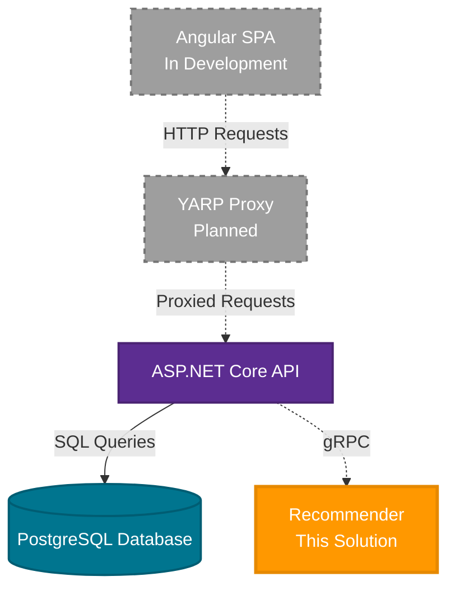
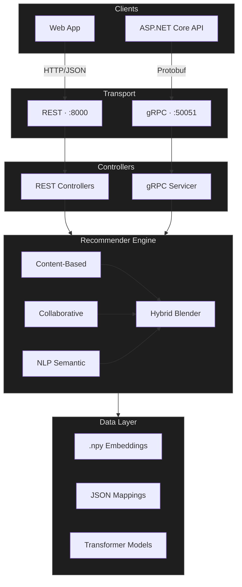

# Anime Recommender Service

A hybrid recommendation microservice for Anime, combining Content-Based Filtering, Collaborative Filtering, and Natural Language Processing. Exposes both a **REST (FastAPI)** and a **gRPC** interface.

[](https://www.python.org/)
[](https://fastapi.tiangolo.com/)
[](https://grpc.io/)
[](https://huggingface.co/)
[](https://scikit-learn.org/)
[](https://docs.pydantic.dev/)

## System Overview



**Current Status**: The Angular frontend and YARP reverse proxy are in development. This repository contains the recommendation microservice consumed by the REST API.

## Architecture



### [Transport Layer](./grpc_server/server.py)

**Purpose**: Entry point for all incoming traffic across both protocols

- **REST**: FastAPI application bootstrapped in `main.py`, exposed on `:8000`
- **gRPC**: `grpcio` server in `grpc_server/server.py`, exposed on `:50051`
- **Middleware**: CORS configuration via `pydantic-settings` and environment variables

### [Controllers & Servicers](./controllers/)

**Purpose**: Input validation and request routing

- **REST Controllers**: Pydantic model validation, delegates to engine services
- **gRPC Servicer**: Protobuf contract enforcement, maps to the same internal service layer
- **Dependencies**: `recommender/` engine layer only

### [Recommender Engine](./recommender/)

**Purpose**: Core algorithm layer producing anime recommendations

- **Content-Based Filtering**: Cosine similarity over metadata feature vectors
- **Collaborative Filtering**: User–item matrix factorization
- **NLP Semantic Search**: Sentence Transformers for natural language queries
- **Hybrid Blending**: Weighted combination of all three signals into a 1–100 compatibility score

### [Data & Loader Layer](./loader/)

**Purpose**: Asset management and cold-loading at startup

- **Embeddings**: Pre-computed `.npy` vectors for anime and user profiles
- **Mappings**: JSON index files for fast ID lookups
- **Models**: HuggingFace `sentence-transformers` loaded into memory on boot

## Technology Stack

| Layer               | Technologies                          |
| ------------------- | ------------------------------------- |
| **Transport**       | FastAPI, grpcio, uvicorn              |
| **Validation**      | Pydantic, pydantic-settings, Protobuf |
| **ML & Similarity** | scikit-learn, numpy, pandas           |
| **NLP**             | sentence-transformers, transformers   |

## Getting Started

### Prerequisites

- Python 3.10+
- Dependencies in `requirements.txt`

### Setup

```bash
git clone https://github.com/jklzz02/Anime-Recommender
cd Anime-Recommender
```

**Create and activate a virtual environment:**

```bash
python -m venv .venv
source .venv/bin/activate
```

**Install dependencies:**

```bash
pip install -r requirements.txt
```

**Build embeddings** (requires raw datasets placed in `data/`):

```bash
python data/build_embeddings.py
python data/build_collaborative_embeddings.py
```

**Configure environment:**

A [`sample.env`](./sample.env) is provided. Copy it to `.env` and fill in the values:

- `host` / `port` for the REST server
- `grpc_port` for the gRPC server
- `allowed_domains` to avoid CORS issues with the client and API

### Run

```bash
python main.py
```

- **Swagger UI**: `http://127.0.0.1:8000/docs`
- **gRPC**: `localhost:50051` — proto definitions in `grpc_server/proto/`

---
